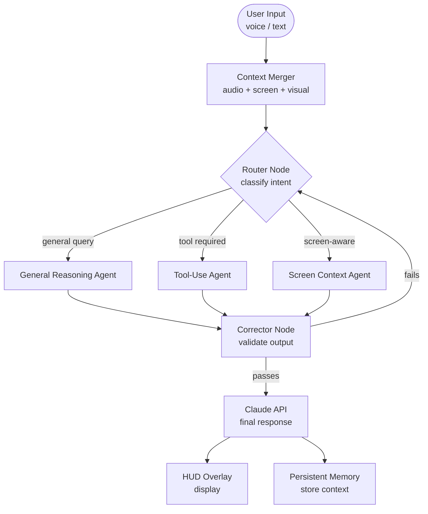

# Fusion Omni — Architecture

> How the subsystems actually fit together.

---

## Overview

Omni is structured as a persistent Windows process with three input pipelines converging into a central agent orchestration layer, which then dispatches to output channels. The design priority throughout has been: **reduce latency on the critical path, keep the HUD feeling instant.**

Everything runs in Python 3.12 on Windows. The orchestration is LangGraph-based with Claude as the primary reasoning model. The HUD overlay is a separate PyQt6 process communicating over a local socket.

---

## Subsystem Map

```
INPUT LAYER
───────────────────────────────────────────────────────

  ┌─────────────────┐  ┌──────────────────────┐  ┌──────────────────┐
  │  Audio Pipeline │  │  Screen Intelligence  │  │ Webcam Perception│
  │                 │  │                       │  │                  │
  │  PyAudio stream │  │  WinUI Automation     │  │  OpenCV capture  │
  │  → VAD filter   │  │  → UI tree snapshot   │  │  → frame buffer  │
  │  → Whisper STT  │  │  → OCR fallback       │  │  → context feed  │
  │  → transcript   │  │  → active app context │  │                  │
  └────────┬────────┘  └──────────┬────────────┘  └────────┬─────────┘
           │                      │                         │
           └──────────────────────┼─────────────────────────┘
                                  │
                                  â–¼
ORCHESTRATION LAYER
───────────────────────────────────────────────────────

                        ┌──────────────────┐
                        │  Context Merger  │
                        │                  │
                        │  combines audio  │
                        │  transcript +    │
                        │  screen context  │
                        │  + visual feed   │
                        └────────┬─────────┘
                                 │
                                 â–¼
                        ┌──────────────────┐
                        │  LangGraph       │
                        │  Agent Graph     │
                        │                  │
                        │  ┌────────────┐  │
                        │  │  Router    │  │
                        │  │  Node      │  │
                        │  └─────┬──────┘  │
                        │        │         │
                        │   ┌────┴─────┐   │
                        │   │          │   │
                        │  ┌▼──────┐ ┌▼──────────┐  │
                        │  │General│ │ Tool-Use  │  │
                        │  │Reason │ │  Agent    │  │
                        │  │ Agent │ │           │  │
                        │  └───┬───┘ └─────┬─────┘  │
                        │      │           │        │
                        │      └─────┬─────┘        │
                        │            │              │
                        │      ┌─────▼──────┐       │
                        │      │ Corrector  │       │
                        │      │   Node     │       │
                        │      │ (validates │       │
                        │      │  output)   │       │
                        │      └─────┬──────┘       │
                        └────────────┼───────────────┘
                                     │
                                     â–¼
                            ┌─────────────────┐
                            │   Claude API    │
                            │                 │
                            │  Primary LLM    │
                            │  reasoning +    │
                            │  character      │
                            └────────┬────────┘

OUTPUT LAYER
───────────────────────────────────────────────────────

              ┌────────────────┬────────────────┐
              │                │                │
              â–¼                â–¼                â–¼
      ┌──────────────┐  ┌──────────┐  ┌──────────────┐
      │  PyQt6 HUD   │  │Persistent│  │  Thermal     │
      │  Overlay     │  │  Memory  │  │  Watchdog    │
      │              │  │  Layer   │  │              │
      │  IPC socket  │  │  JSON    │  │  Monitors    │
      │  → renders   │  │  store + │  │  CPU/GPU     │
      │  response    │  │  context │  │  temps,      │
      │  on screen   │  │  recall  │  │  triggers    │
      └──────────────┘  └──────────┘  │  warnings    │
                                      └──────────────┘
```

---

## Agent Graph — Mermaid Diagram



---

## Subsystem Detail

### HUD Overlay (PyQt6)

The overlay is a frameless, transparent, always-on-top `QMainWindow` running in its own process. It receives render commands over a local Unix-style socket from the main Omni process. Key properties:

- `Qt.FramelessWindowHint | Qt.WindowStaysOnTopHint | Qt.Tool`
- `setAttribute(Qt.WA_TranslucentBackground)`
- Click-through via `WS_EX_LAYERED | WS_EX_TRANSPARENT` (set via ctypes on Windows)
- Renders on top of all applications including fullscreen games (when not in exclusive mode)

Communication with the core is non-blocking. The HUD reads from a queue; missed frames are dropped rather than queued.

---

### Agent Orchestration (LangGraph)

The agent graph uses a state machine model. Each node receives the full `AgentState` object and returns a modified version of it. The router node classifies intent using a lightweight prompt before routing to the appropriate specialist agent.

**Node types:**
- `RouterNode` — intent classification, agent selection
- `ReasoningAgent` — general multi-step reasoning, no external tools
- `ToolAgent` — file system access, web search, application control
- `ScreenAgent` — queries the live UI tree, contextualises what's on screen
- `CorrectorNode` — validates agent output against constraints before passing to Claude

Self-correction loops: if the Corrector node marks output as invalid (hallucination, out-of-scope, contradicts context), it re-routes back to the Router with a failure flag, up to a configurable retry limit (default: 2).

---

### Screen Intelligence (Windows UI Automation)

Uses `pywinauto` and the native `UIAutomation` COM interface to walk the live accessibility tree of the foreground window. Returns a structured snapshot: window title, control tree depth-limited to 4, text content of focused elements.

Fallback: if the accessibility tree returns nothing useful (some applications block it), OpenCV grabs a screenshot and an OCR pass extracts visible text.

This context snapshot is injected into every agent call — Omni always knows what you're looking at.

---

### Audio Pipeline (PyAudio + Whisper)

Continuous microphone capture at 16kHz mono. A voice activity detection (VAD) filter gates Whisper processing — STT only runs on frames where audio energy exceeds threshold. This keeps CPU usage manageable during silence.

Whisper model: `whisper-small` (local, no API call). Transcripts are streamed into the context merger every ~2 seconds of detected speech.

Wake-word detection is handled at the VAD layer before Whisper processes the full audio chunk.

---

### Persistent Memory

A simple JSON-backed key-value store with a time-weighted recency score. On session start, the top N most relevant memories are injected into the system prompt. Memories are written at session end and on explicit "remember this" commands.

Current limitation: retrieval is keyword-based. Semantic search planned for a later build.

---

### Thermal Safety Infrastructure

The most battle-tested subsystem. After the thermal incident of July 2025 (see build log), this became non-negotiable.

- Polls `wmi` for CPU package temp every 5 seconds
- Triggers a warning HUD notification at 85°C
- Requests reduced inference batch size at 90°C
- Suspends all model inference at 95°C with a mandatory cooldown period
- Logs all thermal events to `logs/thermal.log`

BIOS-level power limits on the current hardware (Gigabyte OEM) cannot be modified in software — the thermal watchdog works within those constraints rather than trying to override them.

---

## IPC Design

```
omni_core.py
    │
    ├── spawns ──→  hud_process.py   (PyQt6, separate PID)
    │                    │
    │               listens on 127.0.0.1:9877
    │
    └── sends ──→  HUDCommand(type, payload, duration)
                   serialised as JSON over TCP socket
```

Heartbeat every 10 seconds. If the HUD process dies, the core logs it and attempts a restart before surfacing the error to the user.

---

*Last updated: June 2025*
